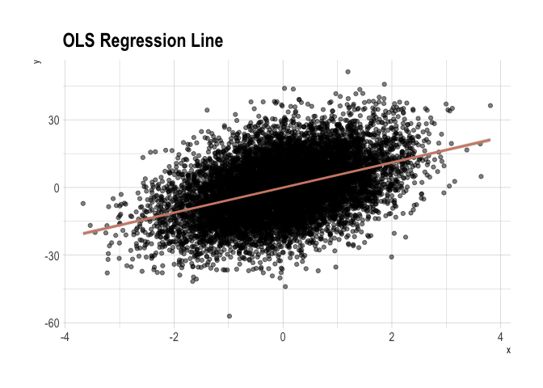
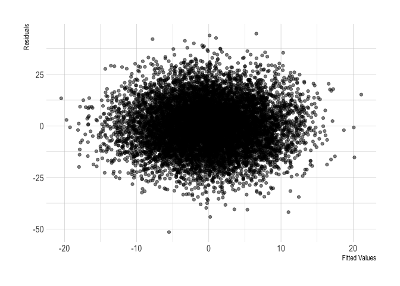

Properties of regression
================

<!-- README.md is generated from README.Rmd. Please edit that file -->

## OLS regression line

``` r
set.seed(1)

# construct the data
dat <- tibble(
  x = rnorm(1E4, 0, 1),
  u = rnorm(1E4, 0, 1),
  y = 5.5 * x + 12 * u
  )

# run the regression
reg <- lm(y ~ x, data = dat)

# fitted values and residuals (two ways to recover them)
dat %<>% mutate(
  yhat1 = predict(reg) %>% unname(),
  yhat2 = coef(reg)[1] + coef(reg)[2] * x,
  uhat1 = reg$residuals %>% unname(),
  uhat2 = y - yhat2
  )

# check equality
all.equal(dat$yhat1, dat$yhat2) & all.equal(dat$uhat1, dat$uhat2)
```

    ## [1] TRUE

``` r
# figure 3
ggplot(dat, aes(x, y)) +
  geom_point(alpha = 0.5) +
  stat_smooth(method = 'lm', col = ipsum_pal()(1)) +
  labs(title = 'OLS Regression Line') +
  theme_ipsum()
```

<!-- -->

``` r
# figure 4
ggplot(dat, aes(yhat1, uhat1)) +
  geom_point(alpha = 0.5) +
  labs(x = 'Fitted Values', y = 'Residuals') +
  theme_ipsum()
```

<!-- -->

## Algebraic properties of OLS

``` r
set.seed(1234)

# construct the data
dat <- tibble(
  x = 9 * rnorm(10, 0, 1),
  u = 36 * rnorm(10, 0, 1),
  y = 3 + 2 * x + u
  )

# run the regression
reg <- lm(y ~ x, data = dat)

# algebraic calculations
dat %<>% mutate(
  yhat = predict(reg) %>% unname(),
  uhat = reg$residuals %>% unname(),
  x_uhat = x * uhat,
  yhat_uhat = yhat * uhat
  )

# table 6
out <- rbind(dat, colSums(dat))
out %<>% cbind(tibble(no = c(1:10, 'Sum')), .)
names(out) <- c(
  names(out)[1:4],
  'hat y',
  'hat u',
  'hat x hat u',
  'hat y hat u'
  )
stargazer(out, digits = 3, rownames = F, summary = F, type = 'html')
```

<table style="text-align:center">

<tr>

<td colspan="8" style="border-bottom: 1px solid black">

</td>

</tr>

<tr>

<td style="text-align:left">

no

</td>

<td>

x

</td>

<td>

u

</td>

<td>

y

</td>

<td>

hat y

</td>

<td>

hat u

</td>

<td>

hat x hat u

</td>

<td>

hat y hat u

</td>

</tr>

<tr>

<td colspan="8" style="border-bottom: 1px solid black">

</td>

</tr>

<tr>

<td style="text-align:left">

1

</td>

<td>

\-10.864

</td>

<td>

\-17.179

</td>

<td>

\-35.906

</td>

<td>

\-17.409

</td>

<td>

\-18.497

</td>

<td>

200.948

</td>

<td>

322.016

</td>

</tr>

<tr>

<td style="text-align:left">

2

</td>

<td>

2.497

</td>

<td>

\-35.942

</td>

<td>

\-27.948

</td>

<td>

\-0.728

</td>

<td>

\-27.220

</td>

<td>

\-67.964

</td>

<td>

19.826

</td>

</tr>

<tr>

<td style="text-align:left">

3

</td>

<td>

9.760

</td>

<td>

\-27.945

</td>

<td>

\-5.425

</td>

<td>

8.340

</td>

<td>

\-13.765

</td>

<td>

\-134.343

</td>

<td>

\-114.792

</td>

</tr>

<tr>

<td style="text-align:left">

4

</td>

<td>

\-21.111

</td>

<td>

2.321

</td>

<td>

\-36.902

</td>

<td>

\-30.203

</td>

<td>

\-6.699

</td>

<td>

141.428

</td>

<td>

202.334

</td>

</tr>

<tr>

<td style="text-align:left">

5

</td>

<td>

3.862

</td>

<td>

34.542

</td>

<td>

45.266

</td>

<td>

0.976

</td>

<td>

44.290

</td>

<td>

171.053

</td>

<td>

43.233

</td>

</tr>

<tr>

<td style="text-align:left">

6

</td>

<td>

4.555

</td>

<td>

\-3.970

</td>

<td>

8.139

</td>

<td>

1.841

</td>

<td>

6.298

</td>

<td>

28.685

</td>

<td>

11.592

</td>

</tr>

<tr>

<td style="text-align:left">

7

</td>

<td>

\-5.173

</td>

<td>

\-18.396

</td>

<td>

\-25.742

</td>

<td>

\-10.304

</td>

<td>

\-15.438

</td>

<td>

79.855

</td>

<td>

159.068

</td>

</tr>

<tr>

<td style="text-align:left">

8

</td>

<td>

\-4.920

</td>

<td>

\-32.803

</td>

<td>

\-39.642

</td>

<td>

\-9.988

</td>

<td>

\-29.655

</td>

<td>

145.891

</td>

<td>

296.185

</td>

</tr>

<tr>

<td style="text-align:left">

9

</td>

<td>

\-5.080

</td>

<td>

\-30.138

</td>

<td>

\-37.298

</td>

<td>

\-10.188

</td>

<td>

\-27.110

</td>

<td>

137.722

</td>

<td>

276.201

</td>

</tr>

<tr>

<td style="text-align:left">

10

</td>

<td>

\-8.010

</td>

<td>

86.970

</td>

<td>

73.949

</td>

<td>

\-13.846

</td>

<td>

87.796

</td>

<td>

\-703.275

</td>

<td>

\-1,215.665

</td>

</tr>

<tr>

<td style="text-align:left">

Sum

</td>

<td>

\-34.484

</td>

<td>

\-42.541

</td>

<td>

\-81.510

</td>

<td>

\-81.510

</td>

<td>

\-0

</td>

<td>

\-0

</td>

<td>

\-0

</td>

</tr>

<tr>

<td colspan="8" style="border-bottom: 1px solid black">

</td>

</tr>

</table>

## Expected value of OLS

``` r
# ols function
ols <- function(...) {
  dat <- tibble(
    x = 9 * rnorm(1E4, 0, 1),
    u = 36 * rnorm(1E4, 0, 1),
    y = 3 + 2 * x + u
    )
  reg <- lm(y ~ x, data = dat)
  return(coef(reg)['x'])
}

# simulate
beta <- replicate(1E3, ols()) ; skim(beta)
```

    ## 
    ## Skim summary statistics
    ## 
    ## ── Variable type:numeric ─────────────────────────────────────────────────────────────────────────────────────────────────────────────
    ##  variable missing complete    n mean    sd   p0  p25 p50  p75 p100
    ##      beta       0     1000 1000    2 0.041 1.87 1.97   2 2.03 2.13
    ##      hist
    ##  ▁▁▃▇▇▆▁▁

``` r
# figure 5
ggplot(tibble(x = beta)) +
  geom_histogram(aes(x)) +
  labs(x = 'Beta', y = 'Count') +
  theme_ipsum()
```

<!-- -->

## Regression anatomy

``` r
library(haven)
library(broom)

# auto dataset
auto <- read_dta('http://www.stata-press.com/data/r8/auto.dta') %>% 
  zap_formats() %>% 
  zap_labels() 

# add a column with residuals from the 1st aux. regresssion
resid_col <- . %>% 
  lm(length ~ weight + headroom + mpg, data = .) %>% 
  augment() %>% 
  pull(.resid)

auto %<>% mutate(length_resid = resid_col(.))

coefs <- list(bivariate = price ~ length,
              multivariate = price ~ length + weight + headroom + mpg,
              aux1 = length ~ weight + headroom + mpg,
              aux2 = price ~ length_resid) %>% 
  map(.f = ~ lm(.x, data = auto) %>% tidy()) %>% 
  tibble(tidied = .) %>% 
  unnest(.id = "reg") 

coefs %>% 
  filter(term %in% c("length", "length_resid"))
```

    ## # A tibble: 3 x 6
    ##   reg          term         estimate std.error statistic  p.value
    ##   <chr>        <chr>           <dbl>     <dbl>     <dbl>    <dbl>
    ## 1 bivariate    length           57.2      14.1      4.06 0.000122
    ## 2 multivariate length          -94.5      40.4     -2.34 0.0222  
    ## 3 aux2         length_resid    -94.5      48.6     -1.94 0.0560

``` r
# OLS estimator 
auto %>% 
  summarise(beta = cov(price, length_resid)/var(length_resid))
```

    ## # A tibble: 1 x 1
    ##    beta
    ##   <dbl>
    ## 1 -94.5

``` r
pauto <- bind_rows(list(BV = auto, MV = auto), .id = "type") %>% 
  mutate(length = case_when(
    type == "BV" ~ length - mean(length), 
    TRUE ~ length_resid)) %>% 
  select(price, length, type)

# shift factor (mean adjustment of length requires adjustment of intercept)
s_factor <- coefs %>% 
  filter(reg == "bivariate", term == "length") %>% 
  pull(estimate) * mean(auto$length)
```

``` r
coefs_filt <- coefs %>% 
  filter(reg %in% c("bivariate", "aux2")) %>% 
  mutate(estimate = case_when(
    term == "(Intercept)" & reg == "bivariate" ~ estimate + s_factor,
    TRUE ~ estimate
  ), 
  term = case_when(
    term == "length_resid" ~ "length", 
    TRUE ~ term
  )) %>% 
  select(reg:estimate) %>% 
  spread(term, estimate) 

ggplot(pauto) + 
  geom_point(aes(length, price, colour = type)) + 
  scale_colour_ipsum(name = 'Type')  + 
  geom_abline(data = coefs_filt, 
              aes(intercept = `(Intercept)`, 
                  slope = length, 
                  col = reg)) + 
  labs(title = 'Regression Anatomy', x = 'Length', y = 'Price') +
  theme_ipsum() 
```

<!-- -->
