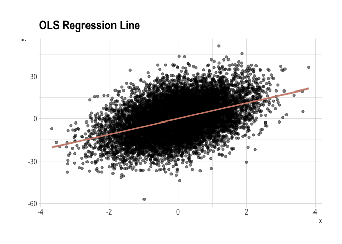
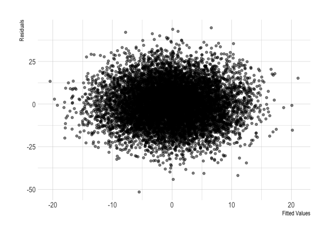
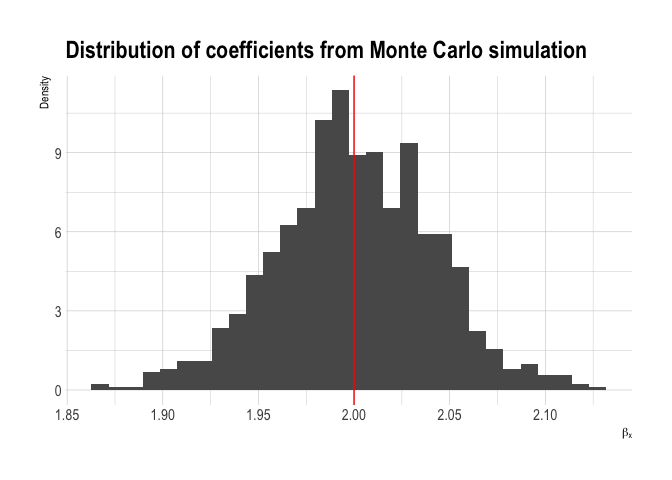
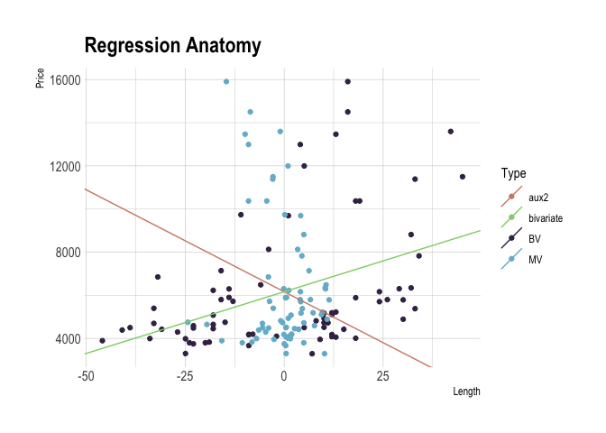

Properties of regression
================

<!-- README.md is generated from README.Rmd. Please edit that file -->

## OLS regression line

``` r
set.seed(1)

# construct the data
dat <- tibble(
  x = rnorm(1E4, 0, 1),
  u = rnorm(1E4, 0, 1),
  y = 5.5 * x + 12 * u
  )

# regress y on x 
reg <- lm(y ~ x, data = dat)

# create single-row data-frame of coefficient estimates
reg %>% 
  tidy() %>% # obtain coefs in tidy tibble
  select(term, estimate) %>% 
  spread(term, estimate) -> coefs
coefs 
```

    ## # A tibble: 1 x 2
    ##   `(Intercept)`     x
    ##           <dbl> <dbl>
    ## 1       -0.0499  5.56

``` r
# fitted values and residuals (two ways to recover them)
reg %>% 
  augment() %>% # add fitted values, resid to original data 
  mutate(yhat1 = .fitted,
         # take advantage of simplifying property of [[ here
         yhat2 = coefs[["(Intercept)"]] + coefs[["x"]] * dat[["x"]],
         uhat1 = .resid,
         uhat2 = y - yhat2) -> preds_resids

# check equality
preds_resids %>% 
  summarise(all.equal(yhat1, yhat2) & all.equal(uhat1, uhat2))
```

    ## # A tibble: 1 x 1
    ##   `all.equal(yhat1, yhat2) & all.equal(uhat1, uhat2)`
    ##   <lgl>                                              
    ## 1 TRUE

``` r
# figure 3
ggplot(preds_resids, aes(x, y)) +
  geom_point(alpha = 0.5) +
  geom_smooth(method = 'lm', col = ipsum_pal()(1)) +
  labs(title = 'OLS Regression Line') +
  theme_ipsum()
```

<!-- -->

``` r
# figure 4
ggplot(preds_resids, aes(yhat1, uhat1)) +
  geom_point(alpha = 0.5) +
  labs(x = 'Fitted Values', y = 'Residuals') +
  theme_ipsum()
```

<!-- -->

## Algebraic properties of OLS

### Show that the sum of the OLS residual always adds up to zero

``` r
set.seed(1234)

# construct the data
dat <- tibble(
  x = 9 * rnorm(10, 0, 1),
  u = 36 * rnorm(10, 0, 1),
  y = 3 + 2 * x + u
  )

reg <- lm(y ~ x, data = dat)

# fitted values and residuals (two ways to recover them)
reg %>% 
  augment() %>% 
  mutate(id = row_number(),
         yhat = .fitted,
         uhat = .resid,
         x_uhat = x * uhat, 
         yhat_uhat = yhat * uhat) %>% 
  select(id, x, uhat, y, yhat, uhat, x_uhat, yhat_uhat) %>% 
  gt(rowname_col = "id") %>% 
  tab_header(title = "OLS residuals always sum to zero") %>% 
  fmt_number(columns = vars(x, uhat, y, yhat, 
                            x_uhat, yhat_uhat), 
             decimals = 3) %>% 
  summary_rows(fns = list(~ sum(., na.rm = TRUE))) 
```

<!--html_preserve-->

<style>html {
  font-family: -apple-system, BlinkMacSystemFont, 'Segoe UI', Roboto, Oxygen, Ubuntu, Cantarell, 'Helvetica Neue', 'Fira Sans', 'Droid Sans', Arial, sans-serif;
}

#htplcwisvd .gt_table {
  display: table;
  border-collapse: collapse;
  margin-left: auto;
  margin-right: auto;
  color: #000000;
  font-size: 16px;
  background-color: #FFFFFF;
  /* table.background.color */
  width: auto;
  /* table.width */
  border-top-style: solid;
  /* table.border.top.style */
  border-top-width: 2px;
  /* table.border.top.width */
  border-top-color: #A8A8A8;
  /* table.border.top.color */
}

#htplcwisvd .gt_heading {
  background-color: #FFFFFF;
  /* heading.background.color */
  border-bottom-color: #FFFFFF;
}

#htplcwisvd .gt_title {
  color: #000000;
  font-size: 125%;
  /* heading.title.font.size */
  padding-top: 4px;
  /* heading.top.padding */
  padding-bottom: 1px;
  border-bottom-color: #FFFFFF;
  border-bottom-width: 0;
}

#htplcwisvd .gt_subtitle {
  color: #000000;
  font-size: 85%;
  /* heading.subtitle.font.size */
  padding-top: 1px;
  padding-bottom: 4px;
  /* heading.bottom.padding */
  border-top-color: #FFFFFF;
  border-top-width: 0;
}

#htplcwisvd .gt_bottom_border {
  border-bottom-style: solid;
  /* heading.border.bottom.style */
  border-bottom-width: 2px;
  /* heading.border.bottom.width */
  border-bottom-color: #A8A8A8;
  /* heading.border.bottom.color */
}

#htplcwisvd .gt_column_spanner {
  border-bottom-style: solid;
  border-bottom-width: 2px;
  border-bottom-color: #A8A8A8;
  padding-top: 4px;
  padding-bottom: 4px;
}

#htplcwisvd .gt_col_heading {
  color: #000000;
  background-color: #FFFFFF;
  /* column_labels.background.color */
  font-size: 16px;
  /* column_labels.font.size */
  font-weight: initial;
  /* column_labels.font.weight */
  vertical-align: middle;
  padding: 10px;
  margin: 10px;
}

#htplcwisvd .gt_sep_right {
  border-right: 5px solid #FFFFFF;
}

#htplcwisvd .gt_group_heading {
  padding: 8px;
  color: #000000;
  background-color: #FFFFFF;
  /* row_group.background.color */
  font-size: 16px;
  /* row_group.font.size */
  font-weight: initial;
  /* row_group.font.weight */
  border-top-style: solid;
  /* row_group.border.top.style */
  border-top-width: 2px;
  /* row_group.border.top.width */
  border-top-color: #A8A8A8;
  /* row_group.border.top.color */
  border-bottom-style: solid;
  /* row_group.border.bottom.style */
  border-bottom-width: 2px;
  /* row_group.border.bottom.width */
  border-bottom-color: #A8A8A8;
  /* row_group.border.bottom.color */
  vertical-align: middle;
}

#htplcwisvd .gt_empty_group_heading {
  padding: 0.5px;
  color: #000000;
  background-color: #FFFFFF;
  /* row_group.background.color */
  font-size: 16px;
  /* row_group.font.size */
  font-weight: initial;
  /* row_group.font.weight */
  border-top-style: solid;
  /* row_group.border.top.style */
  border-top-width: 2px;
  /* row_group.border.top.width */
  border-top-color: #A8A8A8;
  /* row_group.border.top.color */
  border-bottom-style: solid;
  /* row_group.border.bottom.style */
  border-bottom-width: 2px;
  /* row_group.border.bottom.width */
  border-bottom-color: #A8A8A8;
  /* row_group.border.bottom.color */
  vertical-align: middle;
}

#htplcwisvd .gt_striped {
  background-color: #f2f2f2;
}

#htplcwisvd .gt_from_md > :first-child {
  margin-top: 0;
}

#htplcwisvd .gt_from_md > :last-child {
  margin-bottom: 0;
}

#htplcwisvd .gt_row {
  padding: 8px;
  /* row.padding */
  margin: 10px;
  vertical-align: middle;
}

#htplcwisvd .gt_stub {
  border-right-style: solid;
  border-right-width: 2px;
  border-right-color: #A8A8A8;
  padding-left: 12px;
}

#htplcwisvd .gt_summary_row {
  color: #000000;
  background-color: #FFFFFF;
  /* summary_row.background.color */
  padding: 8px;
  /* summary_row.padding */
  text-transform: inherit;
  /* summary_row.text_transform */
}

#htplcwisvd .gt_grand_summary_row {
  color: #000000;
  background-color: #FFFFFF;
  /* grand_summary_row.background.color */
  padding: 8px;
  /* grand_summary_row.padding */
  text-transform: inherit;
  /* grand_summary_row.text_transform */
}

#htplcwisvd .gt_first_summary_row {
  border-top-style: solid;
  border-top-width: 2px;
  border-top-color: #A8A8A8;
}

#htplcwisvd .gt_first_grand_summary_row {
  border-top-style: double;
  border-top-width: 6px;
  border-top-color: #A8A8A8;
}

#htplcwisvd .gt_table_body {
  border-top-style: solid;
  /* table_body.border.top.style */
  border-top-width: 2px;
  /* table_body.border.top.width */
  border-top-color: #A8A8A8;
  /* table_body.border.top.color */
  border-bottom-style: solid;
  /* table_body.border.bottom.style */
  border-bottom-width: 2px;
  /* table_body.border.bottom.width */
  border-bottom-color: #A8A8A8;
  /* table_body.border.bottom.color */
}

#htplcwisvd .gt_footnote {
  font-size: 90%;
  /* footnote.font.size */
  padding: 4px;
  /* footnote.padding */
}

#htplcwisvd .gt_sourcenote {
  font-size: 90%;
  /* sourcenote.font.size */
  padding: 4px;
  /* sourcenote.padding */
}

#htplcwisvd .gt_center {
  text-align: center;
}

#htplcwisvd .gt_left {
  text-align: left;
}

#htplcwisvd .gt_right {
  text-align: right;
  font-variant-numeric: tabular-nums;
}

#htplcwisvd .gt_font_normal {
  font-weight: normal;
}

#htplcwisvd .gt_font_bold {
  font-weight: bold;
}

#htplcwisvd .gt_font_italic {
  font-style: italic;
}

#htplcwisvd .gt_super {
  font-size: 65%;
}

#htplcwisvd .gt_footnote_glyph {
  font-style: italic;
  font-size: 65%;
}
</style>

<div id="htplcwisvd" style="overflow-x:auto;overflow-y:auto;width:auto;height:auto;">

<!--gt table start-->

<table class="gt_table">

<thead>

<tr>

<th colspan="7" class="gt_heading gt_title gt_font_normal gt_center">

OLS residuals always sum to
zero

</th>

</tr>

<tr>

<th colspan="7" class="gt_heading gt_subtitle gt_font_normal gt_center gt_bottom_border">

</th>

</tr>

</thead>

<tr>

<th class="gt_col_heading gt_left" rowspan="1" colspan="1">

</th>

<th class="gt_col_heading gt_right" rowspan="1" colspan="1">

x

</th>

<th class="gt_col_heading gt_right" rowspan="1" colspan="1">

uhat

</th>

<th class="gt_col_heading gt_right" rowspan="1" colspan="1">

y

</th>

<th class="gt_col_heading gt_right" rowspan="1" colspan="1">

yhat

</th>

<th class="gt_col_heading gt_right" rowspan="1" colspan="1">

x\_uhat

</th>

<th class="gt_col_heading gt_right" rowspan="1" colspan="1">

yhat\_uhat

</th>

</tr>

<tbody class="gt_table_body">

<tr>

<td class="gt_row gt_stub gt_left">

1

</td>

<td class="gt_row gt_right">

−10.864

</td>

<td class="gt_row gt_right">

−18.497

</td>

<td class="gt_row gt_right">

−35.906

</td>

<td class="gt_row gt_right">

−17.409

</td>

<td class="gt_row gt_right">

200.948

</td>

<td class="gt_row gt_right">

322.016

</td>

</tr>

<tr>

<td class="gt_row gt_stub gt_left">

2

</td>

<td class="gt_row gt_right gt_striped">

2.497

</td>

<td class="gt_row gt_right gt_striped">

−27.220

</td>

<td class="gt_row gt_right gt_striped">

−27.948

</td>

<td class="gt_row gt_right gt_striped">

−0.728

</td>

<td class="gt_row gt_right gt_striped">

−67.964

</td>

<td class="gt_row gt_right gt_striped">

19.826

</td>

</tr>

<tr>

<td class="gt_row gt_stub gt_left">

3

</td>

<td class="gt_row gt_right">

9.760

</td>

<td class="gt_row gt_right">

−13.765

</td>

<td class="gt_row gt_right">

−5.425

</td>

<td class="gt_row gt_right">

8.340

</td>

<td class="gt_row gt_right">

−134.343

</td>

<td class="gt_row gt_right">

−114.792

</td>

</tr>

<tr>

<td class="gt_row gt_stub gt_left">

4

</td>

<td class="gt_row gt_right gt_striped">

−21.111

</td>

<td class="gt_row gt_right gt_striped">

−6.699

</td>

<td class="gt_row gt_right gt_striped">

−36.902

</td>

<td class="gt_row gt_right gt_striped">

−30.203

</td>

<td class="gt_row gt_right gt_striped">

141.428

</td>

<td class="gt_row gt_right gt_striped">

202.334

</td>

</tr>

<tr>

<td class="gt_row gt_stub gt_left">

5

</td>

<td class="gt_row gt_right">

3.862

</td>

<td class="gt_row gt_right">

44.290

</td>

<td class="gt_row gt_right">

45.266

</td>

<td class="gt_row gt_right">

0.976

</td>

<td class="gt_row gt_right">

171.053

</td>

<td class="gt_row gt_right">

43.233

</td>

</tr>

<tr>

<td class="gt_row gt_stub gt_left">

6

</td>

<td class="gt_row gt_right gt_striped">

4.555

</td>

<td class="gt_row gt_right gt_striped">

6.298

</td>

<td class="gt_row gt_right gt_striped">

8.139

</td>

<td class="gt_row gt_right gt_striped">

1.841

</td>

<td class="gt_row gt_right gt_striped">

28.685

</td>

<td class="gt_row gt_right gt_striped">

11.592

</td>

</tr>

<tr>

<td class="gt_row gt_stub gt_left">

7

</td>

<td class="gt_row gt_right">

−5.173

</td>

<td class="gt_row gt_right">

−15.438

</td>

<td class="gt_row gt_right">

−25.742

</td>

<td class="gt_row gt_right">

−10.304

</td>

<td class="gt_row gt_right">

79.855

</td>

<td class="gt_row gt_right">

159.068

</td>

</tr>

<tr>

<td class="gt_row gt_stub gt_left">

8

</td>

<td class="gt_row gt_right gt_striped">

−4.920

</td>

<td class="gt_row gt_right gt_striped">

−29.655

</td>

<td class="gt_row gt_right gt_striped">

−39.642

</td>

<td class="gt_row gt_right gt_striped">

−9.988

</td>

<td class="gt_row gt_right gt_striped">

145.891

</td>

<td class="gt_row gt_right gt_striped">

296.185

</td>

</tr>

<tr>

<td class="gt_row gt_stub gt_left">

9

</td>

<td class="gt_row gt_right">

−5.080

</td>

<td class="gt_row gt_right">

−27.110

</td>

<td class="gt_row gt_right">

−37.298

</td>

<td class="gt_row gt_right">

−10.188

</td>

<td class="gt_row gt_right">

137.722

</td>

<td class="gt_row gt_right">

276.201

</td>

</tr>

<tr>

<td class="gt_row gt_stub gt_left">

10

</td>

<td class="gt_row gt_right gt_striped">

−8.010

</td>

<td class="gt_row gt_right gt_striped">

87.796

</td>

<td class="gt_row gt_right gt_striped">

73.949

</td>

<td class="gt_row gt_right gt_striped">

−13.846

</td>

<td class="gt_row gt_right gt_striped">

−703.275

</td>

<td class="gt_row gt_right gt_striped">

−1,215.665

</td>

</tr>

<tr>

<td class="gt_stub gt_row gt_grand_summary_row gt_first_grand_summary_row gt_left">

sum

</td>

<td class="gt_row gt_grand_summary_row gt_first_grand_summary_row gt_right">

−34.48

</td>

<td class="gt_row gt_grand_summary_row gt_first_grand_summary_row gt_right">

−0.00

</td>

<td class="gt_row gt_grand_summary_row gt_first_grand_summary_row gt_right">

−81.51

</td>

<td class="gt_row gt_grand_summary_row gt_first_grand_summary_row gt_right">

−81.51

</td>

<td class="gt_row gt_grand_summary_row gt_first_grand_summary_row gt_right">

−0.00

</td>

<td class="gt_row gt_grand_summary_row gt_first_grand_summary_row gt_right">

−0.00

</td>

</tr>

</tbody>

</table>

<!--gt table end-->

</div>

<!--/html_preserve-->

``` r
means <- dat %>% summarise_all(mean)

tidy(reg) %>% 
  select(term, estimate) %>% 
  spread(term, estimate) %>% 
  mutate(av_pred = `(Intercept)` + means$x * x, 
         mean_y = means$y)
```

    ## # A tibble: 1 x 4
    ##   `(Intercept)`     x av_pred mean_y
    ##           <dbl> <dbl>   <dbl>  <dbl>
    ## 1         -3.85  1.25   -8.15  -8.15

## Unbiasness: Monte Carlo simulation of OLS

``` r
# ols function
ols <- function(...) {
  dat <- tibble(
    x = 9 * rnorm(1E4, 0, 1),
    u = 36 * rnorm(1E4, 0, 1),
    y = 3 + 2 * x + u
    ) %>% 
    lm(y ~ x, data = .)
}

betas_df <- map_df(1:1E3, ~ tidy(ols(.)), .id = "id") %>% 
  unnest() %>% 
  filter(term == "x") %>% 
  select(beta = estimate) 

skim(betas_df) %>% skimr::kable()
```

Skim summary statistics  
n obs: 1000  
n variables: 1

Variable type: numeric

<table>

<thead>

<tr>

<th>

variable

</th>

<th>

missing

</th>

<th>

complete

</th>

<th>

n

</th>

<th>

mean

</th>

<th>

sd

</th>

<th>

p0

</th>

<th>

p25

</th>

<th>

p50

</th>

<th>

p75

</th>

<th>

p100

</th>

<th>

hist

</th>

</tr>

</thead>

<tbody>

<tr>

<td>

beta

</td>

<td>

0

</td>

<td>

1000

</td>

<td>

1000

</td>

<td>

2

</td>

<td>

0.041

</td>

<td>

1.87

</td>

<td>

1.97

</td>

<td>

2

</td>

<td>

2.03

</td>

<td>

2.13

</td>

<td>

▁▁▃▇▇▆▁▁

</td>

</tr>

</tbody>

</table>

``` r
# figure 5
ggplot(betas_df, aes(x = beta, y = ..density..)) +
  geom_histogram() +
  geom_vline(xintercept = 2, col = "red") + 
  labs(title = "Distribution of coefficients from Monte Carlo simulation", 
       x = TeX("$\\beta_{x}$", ), y = 'Density') +
  theme_ipsum()
```

<!-- -->

## Regression anatomy theorem

``` r
# auto dataset
auto <- read_dta('http://www.stata-press.com/data/r8/auto.dta') %>% 
  # cleaning up some of the Stata metadata
  zap_formats() %>% 
  zap_labels() 

# add the residuals to the data frame 
auto %<>% 
  mutate(length_resid = residuals(lm(length ~ weight + headroom + mpg, 
                                     data = .)))

# create a data frame of estimates from each regression in the list
coefs <- list(bivariate = price ~ length,
              multivariate = price ~ length + weight + headroom + mpg,
              aux1 = length ~ weight + headroom + mpg,
              aux2 = price ~ length_resid) %>% 
  map_df(.f = ~ tidy(lm(.x, data = auto)), 
         .id = "reg") 

# select the coefficients from the original regression and 
# the partialled-out version
coefs %>% 
  filter(term %in% c("length", "length_resid")) %>% 
  select(reg:estimate) %>% 
  knitr::kable() 
```

<table>

<thead>

<tr>

<th style="text-align:left;">

reg

</th>

<th style="text-align:left;">

term

</th>

<th style="text-align:right;">

estimate

</th>

</tr>

</thead>

<tbody>

<tr>

<td style="text-align:left;">

bivariate

</td>

<td style="text-align:left;">

length

</td>

<td style="text-align:right;">

57.20224

</td>

</tr>

<tr>

<td style="text-align:left;">

multivariate

</td>

<td style="text-align:left;">

length

</td>

<td style="text-align:right;">

\-94.49651

</td>

</tr>

<tr>

<td style="text-align:left;">

aux2

</td>

<td style="text-align:left;">

length\_resid

</td>

<td style="text-align:right;">

\-94.49651

</td>

</tr>

</tbody>

</table>

OLS slope estimate: \[\hat \beta_1 = \frac{C(x,y)}{Var(x)} \]

``` r
# OLS estimate 
auto %>% 
  summarise(beta = cov(price, length_resid) / var(length_resid))
```

    ## # A tibble: 1 x 1
    ##    beta
    ##   <dbl>
    ## 1 -94.5

``` r
pauto <- bind_rows(list(BV = auto, MV = auto), .id = "type") %>% 
  mutate(length = case_when(
    type == "BV" ~ length - mean(length), 
    TRUE ~ length_resid)) %>% 
  select(price, length, type)

# shift factor (mean adjustment of length requires adjustment of intercept)
s_factor <- coefs %>% 
  filter(reg == "bivariate", term == "length") %>% 
  pull(estimate) * mean(auto$length)
```

``` r
coefs_filt <- coefs %>% 
  filter(reg %in% c("bivariate", "aux2")) %>% 
  mutate(estimate = case_when(
    term == "(Intercept)" & reg == "bivariate" ~ estimate + s_factor,
    TRUE ~ estimate),
         term = case_when(
           term == "length_resid" ~ "length",
           TRUE ~ term)) %>% 
  select(reg:estimate) %>% 
  spread(term, estimate) 

ggplot(pauto) + 
  geom_point(aes(length, price, colour = type)) + 
  scale_colour_ipsum(name = 'Type')  + 
  geom_abline(data = coefs_filt, 
              aes(intercept = `(Intercept)`, 
                  slope = length, 
                  col = reg)) + 
  labs(title = 'Regression Anatomy', 
       x = 'Length', y = 'Price') +
  theme_ipsum() 
```

<!-- -->
