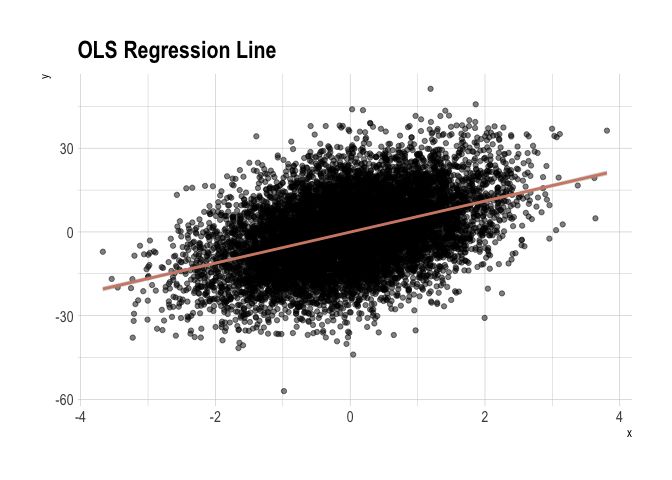
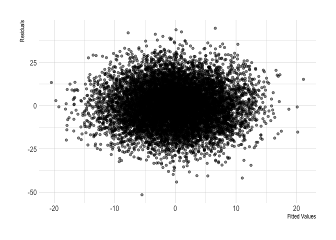

Properties of regression
================

<!-- README.md is generated from README.Rmd. Please edit that file -->

## OLS regression line

``` r
set.seed(1)

# construct the data
dat <- tibble(
  x = rnorm(1E4, 0, 1),
  u = rnorm(1E4, 0, 1),
  y = 5.5 * x + 12 * u
  )

# run the regression
reg <- lm(y ~ x, data = dat)

coefs <- tidy(reg) %>% pull(estimate) 
names(coefs) <- tidy(reg) %>% pull(term)

# fitted values and residuals (two ways to recover them)
preds_resids <- reg %>% 
  augment() %>% 
  mutate(yhat1 = .fitted,
         yhat2 = coefs["(Intercept)"] + coefs["x"] * dat$x,
         uhat1 = .resid,
         uhat2 = y - yhat2)

# check equality
preds_resids %>% 
  summarise(all.equal(yhat1, yhat2) & all.equal(uhat1, uhat2))
```

    ## # A tibble: 1 x 1
    ##   `all.equal(yhat1, yhat2) & all.equal(uhat1, uhat2)`
    ##   <lgl>                                              
    ## 1 TRUE

``` r
# figure 3
ggplot(preds_resids, aes(x, y)) +
  geom_point(alpha = 0.5) +
  geom_smooth(method = 'lm', col = ipsum_pal()(1)) +
  labs(title = 'OLS Regression Line') +
  theme_ipsum()
```

<!-- -->

``` r
# figure 4
ggplot(preds_resids, aes(yhat1, uhat1)) +
  geom_point(alpha = 0.5) +
  labs(x = 'Fitted Values', y = 'Residuals') +
  theme_ipsum()
```

<!-- -->

## Algebraic properties of OLS

``` r
set.seed(1234)

# construct the data
dat <- tibble(
  x = 9 * rnorm(10, 0, 1),
  u = 36 * rnorm(10, 0, 1),
  y = 3 + 2 * x + u
  )

reg <- lm(y ~ x, data = dat)

# fitted values and residuals (two ways to recover them)
reg %>% 
  augment() %>% 
  mutate(id = row_number(),
         yhat = .fitted,
         uhat = .resid,
         x_uhat = x * uhat, 
         yhat_uhat = yhat * uhat) %>% 
  select(id, x, uhat, y, yhat, uhat, x_uhat, yhat_uhat) %>% 
  adorn_totals() %>% 
  adorn_rounding(digits = 3) %>% 
  # styling table
  knitr::kable() %>% 
  kable_styling() %>% 
  row_spec(11, bold = TRUE)
```

<table class="table" style="margin-left: auto; margin-right: auto;">

<thead>

<tr>

<th style="text-align:left;">

id

</th>

<th style="text-align:right;">

x

</th>

<th style="text-align:right;">

uhat

</th>

<th style="text-align:right;">

y

</th>

<th style="text-align:right;">

yhat

</th>

<th style="text-align:right;">

x\_uhat

</th>

<th style="text-align:right;">

yhat\_uhat

</th>

</tr>

</thead>

<tbody>

<tr>

<td style="text-align:left;">

1

</td>

<td style="text-align:right;">

\-10.864

</td>

<td style="text-align:right;">

\-18.497

</td>

<td style="text-align:right;">

\-35.906

</td>

<td style="text-align:right;">

\-17.409

</td>

<td style="text-align:right;">

200.948

</td>

<td style="text-align:right;">

322.016

</td>

</tr>

<tr>

<td style="text-align:left;">

2

</td>

<td style="text-align:right;">

2.497

</td>

<td style="text-align:right;">

\-27.220

</td>

<td style="text-align:right;">

\-27.948

</td>

<td style="text-align:right;">

\-0.728

</td>

<td style="text-align:right;">

\-67.964

</td>

<td style="text-align:right;">

19.826

</td>

</tr>

<tr>

<td style="text-align:left;">

3

</td>

<td style="text-align:right;">

9.760

</td>

<td style="text-align:right;">

\-13.765

</td>

<td style="text-align:right;">

\-5.425

</td>

<td style="text-align:right;">

8.340

</td>

<td style="text-align:right;">

\-134.343

</td>

<td style="text-align:right;">

\-114.792

</td>

</tr>

<tr>

<td style="text-align:left;">

4

</td>

<td style="text-align:right;">

\-21.111

</td>

<td style="text-align:right;">

\-6.699

</td>

<td style="text-align:right;">

\-36.902

</td>

<td style="text-align:right;">

\-30.203

</td>

<td style="text-align:right;">

141.428

</td>

<td style="text-align:right;">

202.334

</td>

</tr>

<tr>

<td style="text-align:left;">

5

</td>

<td style="text-align:right;">

3.862

</td>

<td style="text-align:right;">

44.290

</td>

<td style="text-align:right;">

45.266

</td>

<td style="text-align:right;">

0.976

</td>

<td style="text-align:right;">

171.053

</td>

<td style="text-align:right;">

43.233

</td>

</tr>

<tr>

<td style="text-align:left;">

6

</td>

<td style="text-align:right;">

4.555

</td>

<td style="text-align:right;">

6.298

</td>

<td style="text-align:right;">

8.139

</td>

<td style="text-align:right;">

1.841

</td>

<td style="text-align:right;">

28.685

</td>

<td style="text-align:right;">

11.592

</td>

</tr>

<tr>

<td style="text-align:left;">

7

</td>

<td style="text-align:right;">

\-5.173

</td>

<td style="text-align:right;">

\-15.438

</td>

<td style="text-align:right;">

\-25.742

</td>

<td style="text-align:right;">

\-10.304

</td>

<td style="text-align:right;">

79.855

</td>

<td style="text-align:right;">

159.068

</td>

</tr>

<tr>

<td style="text-align:left;">

8

</td>

<td style="text-align:right;">

\-4.920

</td>

<td style="text-align:right;">

\-29.655

</td>

<td style="text-align:right;">

\-39.642

</td>

<td style="text-align:right;">

\-9.988

</td>

<td style="text-align:right;">

145.891

</td>

<td style="text-align:right;">

296.185

</td>

</tr>

<tr>

<td style="text-align:left;">

9

</td>

<td style="text-align:right;">

\-5.080

</td>

<td style="text-align:right;">

\-27.110

</td>

<td style="text-align:right;">

\-37.298

</td>

<td style="text-align:right;">

\-10.188

</td>

<td style="text-align:right;">

137.722

</td>

<td style="text-align:right;">

276.201

</td>

</tr>

<tr>

<td style="text-align:left;">

10

</td>

<td style="text-align:right;">

\-8.010

</td>

<td style="text-align:right;">

87.796

</td>

<td style="text-align:right;">

73.949

</td>

<td style="text-align:right;">

\-13.846

</td>

<td style="text-align:right;">

\-703.275

</td>

<td style="text-align:right;">

\-1215.665

</td>

</tr>

<tr>

<td style="text-align:left;font-weight: bold;">

Total

</td>

<td style="text-align:right;font-weight: bold;">

\-34.484

</td>

<td style="text-align:right;font-weight: bold;">

0.000

</td>

<td style="text-align:right;font-weight: bold;">

\-81.510

</td>

<td style="text-align:right;font-weight: bold;">

\-81.510

</td>

<td style="text-align:right;font-weight: bold;">

0.000

</td>

<td style="text-align:right;font-weight: bold;">

0.000

</td>

</tr>

</tbody>

</table>

## Expected value of OLS

``` r
# ols function
ols <- function(...) {
  dat <- tibble(
    x = 9 * rnorm(1E4, 0, 1),
    u = 36 * rnorm(1E4, 0, 1),
    y = 3 + 2 * x + u
    ) %>% 
    lm(y ~ x, data = .)
}


betas_df <- map_df(1:1E3, ~ tidy(ols(.)), .id = "id") %>% 
  unnest() %>% 
  filter(term == "x") %>% 
  select(beta = estimate) 

skim(betas_df) %>% skimr::kable()
```

Skim summary statistics  
n obs: 1000  
n variables: 1

Variable type: numeric

<table>

<thead>

<tr>

<th>

variable

</th>

<th>

missing

</th>

<th>

complete

</th>

<th>

n

</th>

<th>

mean

</th>

<th>

sd

</th>

<th>

p0

</th>

<th>

p25

</th>

<th>

p50

</th>

<th>

p75

</th>

<th>

p100

</th>

<th>

hist

</th>

</tr>

</thead>

<tbody>

<tr>

<td>

beta

</td>

<td>

0

</td>

<td>

1000

</td>

<td>

1000

</td>

<td>

2

</td>

<td>

0.041

</td>

<td>

1.87

</td>

<td>

1.97

</td>

<td>

2

</td>

<td>

2.03

</td>

<td>

2.13

</td>

<td>

▁▁▃▇▇▆▁▁

</td>

</tr>

</tbody>

</table>

``` r
# figure 5
ggplot(betas_df, aes(x = beta)) +
  geom_histogram() +
  geom_vline(xintercept = 2, col = "red") + 
  labs(x = 'Beta', y = 'Count') +
  theme_ipsum()
```

<!-- -->

## Regression anatomy

``` r
# auto dataset
auto <- read_dta('http://www.stata-press.com/data/r8/auto.dta') %>% 
  zap_formats() %>% 
  zap_labels() 

# add a column with residuals from the 1st aux. regresssion
resid_col <- . %>% 
  lm(length ~ weight + headroom + mpg, data = .) %>% 
  augment() %>% 
  pull(.resid)

auto %<>% mutate(length_resid = resid_col(.))

coefs <- list(bivariate = price ~ length,
              multivariate = price ~ length + weight + headroom + mpg,
              aux1 = length ~ weight + headroom + mpg,
              aux2 = price ~ length_resid) %>% 
  map(.f = ~ lm(.x, data = auto) %>% tidy()) %>% 
  tibble(tidied = .) %>% 
  unnest(.id = "reg") 

coefs %>% 
  filter(term %in% c("length", "length_resid"))
```

    ## # A tibble: 3 x 6
    ##   reg          term         estimate std.error statistic  p.value
    ##   <chr>        <chr>           <dbl>     <dbl>     <dbl>    <dbl>
    ## 1 bivariate    length           57.2      14.1      4.06 0.000122
    ## 2 multivariate length          -94.5      40.4     -2.34 0.0222  
    ## 3 aux2         length_resid    -94.5      48.6     -1.94 0.0560

``` r
# OLS estimator 
auto %>% 
  summarise(beta = cov(price, length_resid) / var(length_resid))
```

    ## # A tibble: 1 x 1
    ##    beta
    ##   <dbl>
    ## 1 -94.5

``` r
pauto <- bind_rows(list(BV = auto, MV = auto), .id = "type") %>% 
  mutate(length = case_when(
    type == "BV" ~ length - mean(length), 
    TRUE ~ length_resid)) %>% 
  select(price, length, type)

# shift factor (mean adjustment of length requires adjustment of intercept)
s_factor <- coefs %>% 
  filter(reg == "bivariate", term == "length") %>% 
  pull(estimate) * mean(auto$length)
```

``` r
coefs_filt <- coefs %>% 
  filter(reg %in% c("bivariate", "aux2")) %>% 
  mutate(estimate = case_when(
    term == "(Intercept)" & reg == "bivariate" ~ estimate + s_factor,
    TRUE ~ estimate
  ), 
  term = case_when(
    term == "length_resid" ~ "length", 
    TRUE ~ term
  )) %>% 
  select(reg:estimate) %>% 
  spread(term, estimate) 

ggplot(pauto) + 
  geom_point(aes(length, price, colour = type)) + 
  scale_colour_ipsum(name = 'Type')  + 
  geom_abline(data = coefs_filt, 
              aes(intercept = `(Intercept)`, 
                  slope = length, 
                  col = reg)) + 
  labs(title = 'Regression Anatomy', x = 'Length', y = 'Price') +
  theme_ipsum() 
```

<!-- -->
